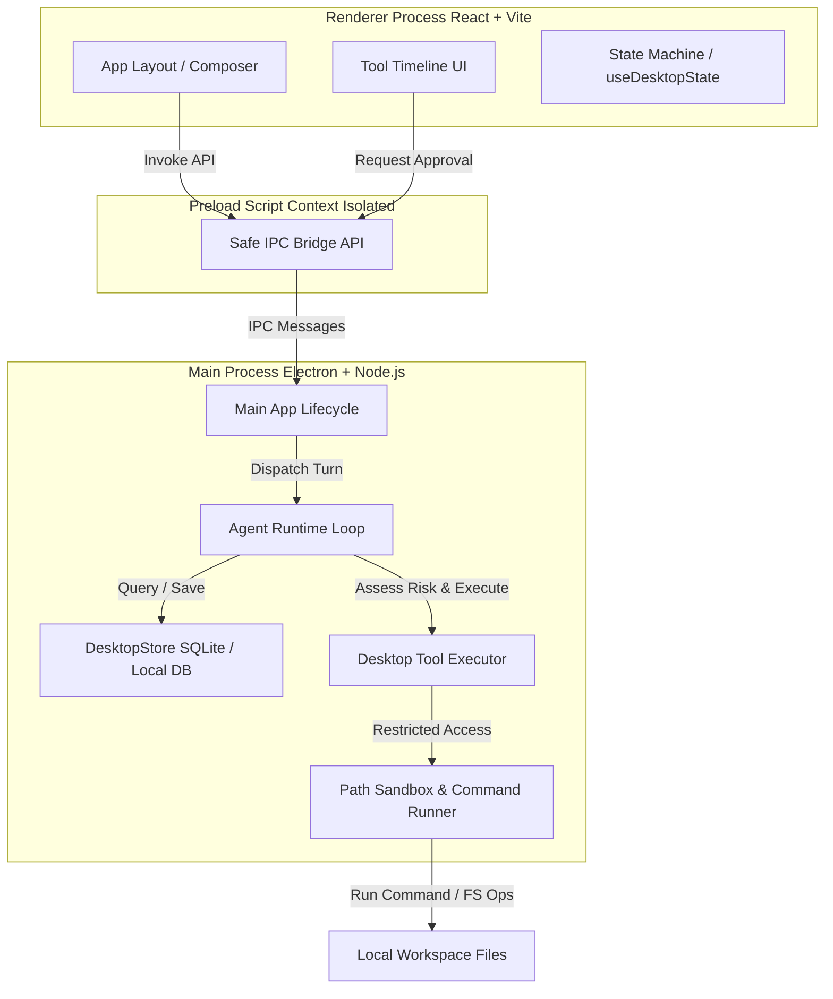

# 💻 Privora Desktop

> **Privora Desktop** is a premium, local-first Electron application shell port designed to orchestrate secure agentic workflows directly on your machine. Equipped with a custom-engineered sandboxed environment, real-time tool timeline visualization, and strict user-controlled execution hooks, it provides a safe, seamless, and high-performance desktop hub for local workspace automation.

---

## 🏗️ Architecture & System Design

Privora Desktop uses a robust multi-process architecture to decouple UI rendering, sandboxed bridge APIs, and agent execution runtimes.



### Key Pillars
* **Strict Security Sandbox**: All file modifications and command executions run through a secure validation gate (`pathSandbox.ts`). Low-risk operations (e.g. reading files) can execute seamlessly, whereas high-risk operations (e.g. running arbitrary commands, modifying critical files) prompt an **interactive review panel** in the user interface.
* **Streamed Tool Timeline**: Users can monitor agent activity in real-time, reviewing step-by-step logs, live terminal output deltas, and file diffs directly inside the interface.
* **Persistent Session Store**: Context, workspaces, threads, settings, and secrets are managed locally using a fast SQL-backed database runtime (`store.ts`).

---

## 🛠️ Technology Stack

* **Shell Runtime**: Electron `v36.4.0` with full context isolation and sandboxing enabled.
* **Frontend View**: React `v19` + TypeScript compiled with Vite `v6.2.0`.
* **Bundler & Packager**: Electron Forge `v7.8.1` with custom Vite plugins for main, preload, and renderer splits.
* **Styling**: Modern, premium CSS styling with dynamic theme-aware properties (e.g. gold-accented dark mode).
* **Testing**: Vitest `v3.1.4` for local unit testing.

---

## 📂 Project Structure

```bash
apps/desktop/
├── src/
│   ├── main/                  # Electron Main Process
│   │   ├── agent/             # Core LLM Runtime, Prompting Context, & Provider adapters
│   │   │   ├── providers/     # SSE, Gemini, and OpenRouter integration adapters
│   │   │   └── tools/         # OS Tool definitions, Executors, and Permissions Engine
│   │   ├── db/                # DesktopStore persistence engine (SQLite database wrapper)
│   │   ├── ipc/               # IPC Main Channels registration
│   │   ├── security/          # Sandbox restrictions, path validation, and redact patterns
│   │   ├── terminal/          # Custom process runners and terminal output buffers
│   │   └── main.ts            # App startup and primary BrowserWindow manager
│   ├── preload/               # Preload script exposing context-isolated IPC bridge APIs
│   ├── renderer/              # React App Frontend (UI Components, styling, and state hooks)
│   └── shared/                # Universal TypeScript types and models shared across processes
├── tests/                     # Isolated test cases for core Main process modules
├── forge.config.ts            # Electron Forge configurations and build packaging hooks
├── tsconfig.json              # TypeScript compilation parameters
└── vite.main.config.ts        # Vite build pipelines for the Electron processes
```

---

## 🚀 Getting Started

### Prerequisites

Ensure you have the following installed on your machine:
* **Node.js**: `v18+` (LTS recommended)
* **npm** or **yarn**
* **Git** (Required for version control integration)

### Installation

Navigate to the desktop application directory and install dependencies:

```bash
cd apps/desktop
npm install
```

---

## 👨‍💻 Development & Debugging

During development, Electron Forge compiles the frontend assets in hot-reload mode using Vite, then launches the Electron shell automatically.

### Commands

| Command | Action |
| :--- | :--- |
| `npm run dev` | Launch the app in development mode with HMR |
| `npm run dev:log` | Launch the app and print detailed Electron logs inside your terminal |
| `npm run dev:debug` | Run the application with active V8 inspect parameters enabled |
| `npm run dev:debug:break` | Run application with breakpoints active on the first line of the main process |
| `npm run lint` | Run compile check and validation inside the project |
| `npm run test` | Execute the unit test suite inside `tests/` utilizing Vitest |

---

## 🧪 Testing

Privora Desktop includes comprehensive unit tests validating path sandboxing, permissions, patching tools, and terminal output buffers.

To run the tests:
```bash
npm run test
```

---

## 📦 Packaging & Distribution

You can build and pack the application for production using Electron Forge.

### 1. Compile & Package Codebase
Compiles all typescript files, bundles React renderer components via Vite, and wraps them inside an Electron application package:
```bash
npm run build
```

### 2. Generate Installers
Builds OS-specific native installers (e.g. `.exe` on Windows using Squirrel.Windows):
```bash
npm run make
```

The resulting installers and distributables will be placed in the `out/make` directory.

---

## 🔒 Security Best Practices

1. **Context Isolation**: Always keep `contextIsolation: true` and `nodeIntegration: false` active in the `BrowserWindow` webPreferences.
2. **Path Sanitization**: Ensure all file operations route through the `PathSandbox` check. Never expose direct, unvalidated node `fs` capabilities directly through the IPC preload bridge.
3. **Sensitive Key Redaction**: Keep all API keys safely stored using `store.ts` secrets and mask key outputs in any logs using `redact.ts`.
