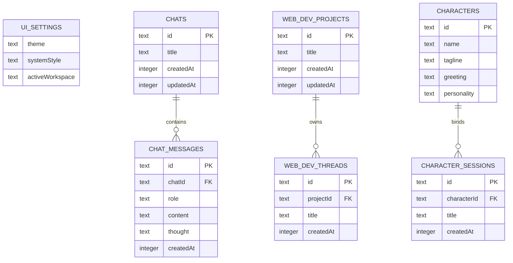

# Privora Mobile

Privora Mobile is a local-first, multi-workspace AI companion port built with Flutter and Dart. It brings the Vite/web application's complete suite of personal workspaces—including multi-provider chat, Canvas artifacts, character hubs, multi-agent debates, and Deep Research—directly to iOS, Android, and Desktop platforms, maintaining absolute privacy and local SQLite database persistence.

---

## Highlights

- **Multi-Provider Client Engines**: Streams responses natively via SSE and REST directly to model APIs (Gemini, OpenRouter, and GPT-5.5 via local CLIProxy) without routing traffic through a middleman server.
- **Relational SQLite Persistence**: Operates on a local-first state model where chats, threads, projects, characters, and settings persist securely inside an on-device relational SQLite database.
- **Canvas Artifacts**: Renders progressive, high-quality rendered drafts of Markdown documentation, tabular reports, diagrams, text briefs, and SVGs inside a dedicated side-drawer.
- **Interactive Deep Research**: Executes long-running research tasks with asynchronous preflight generation, editable execution plans, progressive action tracking, and automatic recovery boundaries.
- **Custom Character Persona Hub**: Host custom companions, gaming NPCs, mentors, and utility bots with session-bound memory contexts and persona limits.
- **Multi-Agent Debate Arena**: Configures and starts debates between two distinct model personas (e.g., A vs. B) judged by a third, custom-selected evaluator model.
- **Model-Aware Attachment Manager**: Selects and validates image and document attachments locally, preparing base64 payloads on demand using platform-native picking handlers.

---

## Tech Stack

| Package | Purpose | Parity / Benefit |
| :--- | :--- | :--- |
| **`flutter_riverpod`** | Core state management & DI | Clean provider overrides for test environments; decoupled from widget lifecycles. |
| **`go_router`** | Declarative route-path workspace | URL-shaped parity (`/chat/:id`, `/web-dev/:id`) matching tanstack-router. |
| **`drift` & `drift_flutter`**| Type-safe relational SQLite engine | Relational data integrity, migrations, and robust query generation. |
| **`flutter_secure_storage`**| Hardware-backed key manager | Platform Keystore/Keychain wrapping for private API keys and endpoints. |
| **`dio`** | Robust HTTP/SSE client | Stream-friendly request pooling, interceptors, and robust timeout handling. |
| **`flutter_markdown_plus`**| Markdown parsing & styling | Renders rich chat text, math formulas, and code block formatting natively. |
| **`google_fonts`** | Typographical style sheet | Renders Inter and Outfit fonts matching the Web app's signature aesthetic. |
| **`lucide_icons_flutter`** | Icon library | 1:1 visual parity with Lucide React icons. |

---

## Setup & Environment

### 1. Install Flutter SDK
Make sure you have Flutter (`>= 3.41.0`) on your machine. You can verify your setup by running:
```bash
flutter doctor
```

### 2. Configure Environment Keys
Create a local `.env` file under the `apps/mobile/` directory, or enter your keys directly in the **Connections** panel within the application settings screen:
```env
GEMINI_API_KEY="your-gemini-key"
OPENROUTER_API_KEY="your-openrouter-key"
CLIPROXY_BASE_URL="http://127.0.0.1:8317"
```

### 3. Retrieve Dependencies & Generate Code
Run package resolutions and execute the build generator to compile Drift's database definitions:
```bash
flutter pub get
flutter pub run build_runner build --delete-conflicting-outputs
```

### 4. Running the Application
Launch the app on your selected desktop emulator, web browser, or connected mobile device:
```bash
flutter run
```

---

## Local API Networking & Proxying

### Android USB Debugging
When testing on a physical Android device connected via USB, map your host machine's CLIProxy port:
```bash
adb reverse tcp:8317 tcp:8317
```
This maps requests to `http://127.0.0.1:8317` on the phone directly to the running CLIProxy server on your dev machine.

### Local Wi-Fi Testing
If you are running the app on a device over local Wi-Fi, replace `127.0.0.1` in your secure connection configurations with your host machine’s local IP address (e.g., `http://192.168.1.10:8317`).

---

## Relational Database Schema

Local-first state is persisted in an SQLite file named `privora_database.sqlite`. Relational modeling is enforced across the following Drift-generated tables:



---

## Workspace Directory Boundaries

To ensure clean decoupling and high testability, the codebase maintains these architectural boundaries inside `lib/src/`:

```text
lib/
  main.dart                           # Application entrypoint
  src/
    app/
      privora_app.dart                # MaterialApp shell & provider config
      router.dart                     # declarative go_router path specs
    core/
      theme/
        privora_theme.dart            # Harmonious Beige/Dark color design tokens
    data/
      local/
        privora_database.dart         # SQLite Drift table schema mapping
        privora_local_repository.dart # Local repository query implementations
      secure/
        secure_credential_repository.dart # Keystore/Keychain secure accessor
    features/
      chat/
        data/                         # Multi-provider chat, image & research clients
      shell/
        privora_shell.dart            # Multi-panel drawer/sidebar scaffold
        chat_viewport.dart            # Message stream component
        chat_composer.dart            # Attachment & options input bar
    models/
      privora_models.dart             # Mirrored entity domain schemas
    state/
      app_state.dart                  # Riverpod AppController & AsyncNotifier
```

---

## Developer Verification Gates

Always verify code compliance and compile-integrity before committing modifications:

```bash
# 1. Format the codebase
dart format lib test

# 2. Check for compile errors and warnings
flutter analyze

# 3. Execute unit and widget test suites
flutter test
```

> [!IMPORTANT]
> The Flutter static analyzer (`flutter analyze`) must return `No issues found!` before features can be merged. Unit tests operate in-memory on mock repositories and database instances.

---

## Security Compliance

1. **Endpoint Protection**: Private API keys and endpoints should *never* be persisted in standard SQLite tables. They must be read/written exclusively through the hardware-backed `SecureCredentialRepository` (`flutter_secure_storage`).
2. **Environment Safeguards**: The `.env` template in the root directory is git-ignored. Do not commit actual production keys in the assets folder or hardcode credentials in provider clients.
3. **No-Middleware Networking**: In the mobile port, client requests go directly to providers. Keep local development proxies constrained to local debug targets.
